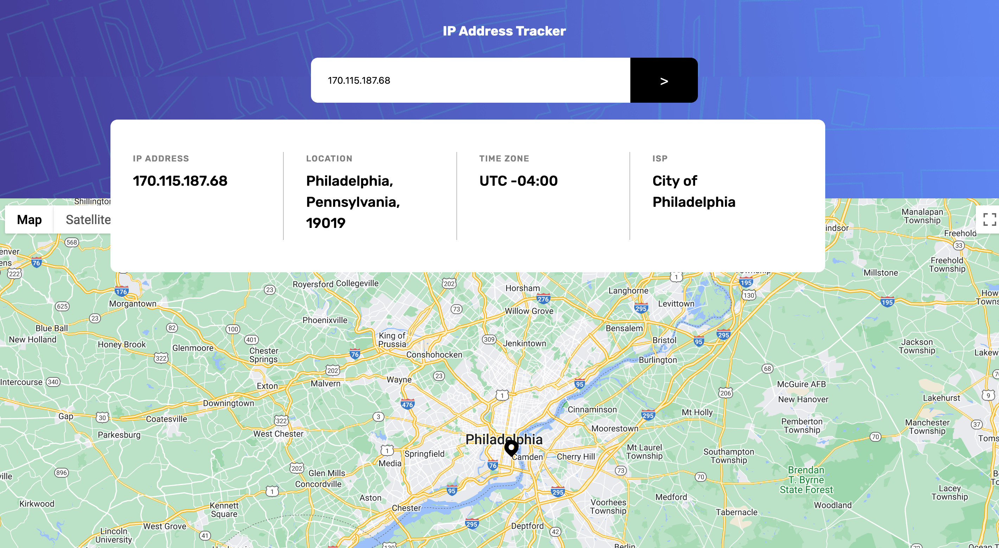

IP Address Tracker

Note: This is a solution to the [IP address tracker challenge on Frontend Mentor](https://www.frontendmentor.io/challenges/ip-address-tracker-I8-0yYAH0).

## Table of contents

- [Overview](#overview)
- [Tutorial](#tutorial)
- [Screenshot](#screenshot)
- [Links](#links)
- [Built with](#built-with)
- [Author](#author)

## Overview
This is a single-page React-based application that allows users to view the location of different IP addresses throughout the world.
To fetch data for the IP's, this app uses the ipify API and for displaying the IP's location, this app uses the Google Maps API.

## Tutorial
To use this application, simply enter a valid IPv4 address into the input field and press enter. The map will then be rendered to show the location of the entered IP address.

### Screenshot

### Links
- Live Site URL: <a href="https://ip-tracker-jason-francois.vercel.app/" target="_blank">Link</a>

### Built with

- HTML
- CSS/SCSS
- React
- [Google Maps API](https://developers.google.com/maps)
- [ipify](https://www.ipify.org/) - Public IP Address API

## Author
- LinkedIn - [Jason François](www.linkedin.com/in/jasonc-francois)
